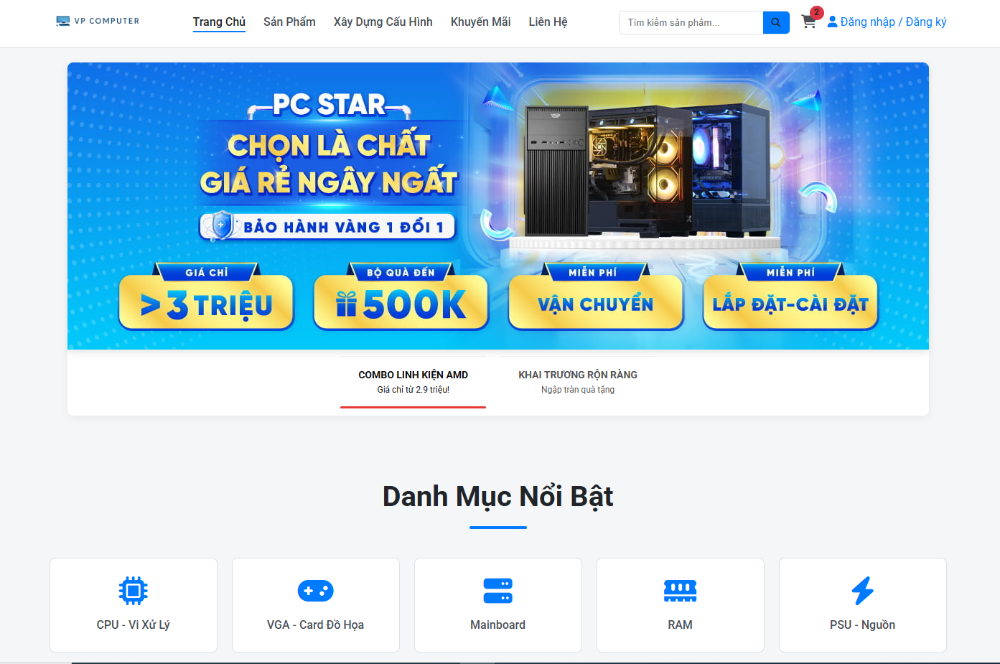

# VP Computer - Website Thương Mại Điện Tử Bán Linh Kiện PC

 <!-- Thay 'screenshot.png' bằng ảnh chụp màn hình đẹp nhất của website bạn -->

Đây là dự án mã nguồn cho website **VP Computer**, một trang thương mại điện tử chuyên cung cấp linh kiện máy tính, gaming gear và các giải pháp PC tùy chỉnh. Dự án được xây dựng hoàn toàn bằng HTML, CSS và JavaScript thuần túy, không phụ thuộc vào các framework lớn, tập trung vào hiệu năng, khả năng tùy biến và trải nghiệm người dùng mượt mà.

## ✨ Các Tính Năng Nổi Bật

### 👤 Giao Diện Khách Hàng (Client-Side)
- **Thiết kế Hiện đại & Responsive:** Giao diện sạch sẽ, chuyên nghiệp, hiển thị đẹp mắt trên mọi thiết bị từ desktop, tablet đến mobile.
- **Trang chủ Năng động:** Slider quảng cáo, danh mục nổi bật, sản phẩm bán chạy được tải động.
- **Trang Sản phẩm Thông minh:**
    - Bộ lọc đa điều kiện (Danh mục, Giá, Thương hiệu).
    - Sắp xếp sản phẩm (Mặc định, Giá tăng/giảm).
    - Hiển thị sản phẩm ngẫu nhiên để tăng khả năng khám phá.
- **Trang Chi tiết Sản phẩm:**
    - Gallery ảnh với hiệu ứng zoom.
    - Hiển thị giá khuyến mãi, thông số kỹ thuật, đánh giá.
    - Logic kiểm tra tình trạng kho hàng.
- **Công cụ Xây dựng Cấu hình (PC Builder):**
    - Cho phép người dùng tự chọn linh kiện.
    - Tự động kiểm tra tính tương thích (Socket CPU & Mainboard, chuẩn RAM, công suất nguồn).
- **Hệ thống Giỏ hàng:**
    - Sidebar giỏ hàng tiện lợi, không cần tải lại trang.
    - Lưu trữ giỏ hàng bằng LocalStorage, không mất khi đóng trình duyệt.
- **Quy trình Thanh toán Hoàn chỉnh:**
    - Trang giỏ hàng chi tiết.
    - Trang thanh toán tối giản.
    - Tự động tạo và tải hóa đơn PDF sau khi đặt hàng.
- **Hệ thống Trang Tĩnh:** Giới thiệu, Tuyển dụng, Chính sách, FAQ... được thiết kế chuyên nghiệp.

### 🔐 Giao Diện Quản Trị (Admin Dashboard)
- **Tách biệt & Bảo mật:** Nằm trong thư mục `/admin` với trang đăng nhập riêng.
- **Tổng quan Trực quan:** Biểu đồ doanh thu, lợi nhuận, và các chỉ số quan trọng.
- **Quản lý Dữ liệu:** Các trang quản lý Sản phẩm, Đơn hàng, Khách hàng với giao diện bảng biểu và responsive.
- **Cấu trúc Module hóa:** Dễ dàng mở rộng thêm các tính năng quản lý mới.

## 🚀 Công Nghệ Sử Dụng

- **Frontend:**
  - **HTML5:** Cấu trúc ngữ nghĩa, chuẩn SEO.
  - **CSS3:**
    - Flexbox & Grid Layout cho bố cục responsive.
    - CSS Variables (Biến CSS) để dễ dàng thay đổi theme.
    - Animation & Transition cho các hiệu ứng mượt mà.
  - **JavaScript (ES6+):**
    - Hoàn toàn không sử dụng framework, tập trung vào JavaScript thuần túy (Vanilla JS).
    - DOM Manipulation để tạo giao diện động.
    - LocalStorage để lưu trữ dữ liệu phía client.
    - Sử dụng Web Components (Custom Elements) để module hóa Header, Footer, Sidebar.
- **Thư viện:**
  - **Font Awesome:** Cho các icon.
  - **jsPDF:** Để tạo hóa đơn PDF phía client.

## ⚙️ Cài Đặt và Chạy Dự Án

Dự án này là một website tĩnh (static website) nên không yêu cầu cài đặt phức tạp.

1.  **Clone a repository:**
    ```bash
    git clone https://github.com/TranHuuDat2004/vpcomputer.com.git
    ```
2.  **Mở file `index.html`:**
    - Cách đơn giản nhất là mở file `index.html` ở thư mục gốc trực tiếp bằng trình duyệt.
    - **Khuyến nghị:** Sử dụng một server ảo để tránh các lỗi liên quan đến CORS khi làm việc với file. Tiện ích **Live Server** trên Visual Studio Code là một lựa chọn tuyệt vời.
      - Cài đặt Live Server trên VS Code.
      - Nhấp chuột phải vào file `index.html` và chọn "Open with Live Server".

## 📜 Giấy Phép

Dự án này được cấp phép theo **Giấy phép Quốc tế Creative Commons Ghi công - Phi thương mại 4.0**.

<a rel="license" href="http://creativecommons.org/licenses/by-nc/4.0/"></a><br />
This work is licensed under a <a rel="license" href="http://creativecommons.org/licenses/by-nc/4.0/">Creative Commons Attribution-NonCommercial 4.0 International License</a>.

**Bạn được tự do:**
*   **Chia sẻ:** Sao chép và phân phối lại tài liệu dưới bất kỳ phương tiện và định dạng nào.
*   **Thích ứng:** Chỉnh sửa, biến đổi và xây dựng dựa trên tài liệu.

**Theo các điều khoản sau:**
*   **Ghi công (Attribution):** Bạn phải ghi công một cách hợp lý, cung cấp một liên kết đến giấy phép và cho biết nếu có thay đổi nào được thực hiện.
*   **Phi thương mại (NonCommercial):** Bạn không được sử dụng tài liệu cho các mục đích thương mại.


### **Hướng Dẫn Thay Đổi Bản Đồ Map (3 bước đơn giản)**

#### **Bước 1: Tìm địa điểm của bạn trên Google Maps**
1.  Truy cập vào [https://www.google.com/maps](https://www.google.com/maps).
2.  Trên thanh tìm kiếm, gõ chính xác địa chỉ bạn muốn hiển thị. Ví dụ: **"Trường Đại học Tôn Đức Thắng"**.
3.  Nhấn Enter. Google Maps sẽ hiển thị đúng vị trí đó.


#### **Bước 2: Lấy mã nhúng (Embed code)**
1.  Sau khi đã tìm thấy đúng địa điểm, hãy nhấp vào nút **"Share"** (Chia sẻ).
2.  Một cửa sổ mới sẽ hiện ra. Hãy chọn tab **"Embed a map"** (Nhúng bản đồ).


#### **Bước 3: Sao chép và dán mã HTML**
1.  Bây giờ, bạn sẽ thấy một đoạn mã `<iframe>...</iframe>`, giống hệt như đoạn mã bạn đã có.
2.  Nhấp vào nút **"COPY HTML"** (SAO CHÉP HTML).
3.  Quay trở lại file **`contact.html`** của bạn.
4.  **Xóa** toàn bộ thẻ `<iframe>` cũ.
5.  **Dán** đoạn mã `<iframe>` mới mà bạn vừa sao chép vào đúng vị trí đó.

---

### **Ví dụ:**

**Đoạn code iframe cũ của bạn (Chợ Bến Thành):**
```html
<iframe src="https://www.google.com/maps/embed?pb=!1m18!1m12!1m3!1d3919.447176274488!2d106.69758097589508!3d10.776992289371725!2m3!1f0!2f0!3f0!3m2!1i1024!2i768!4f13.1!3m3!1m2!1s0x31752f38f9ed8cb5%3A0x1a7da11b714b7417!2zQ2jhu6MgQuG6v24gVGjDoG5o!5e0!3m2!1svi!2s!4v1699999999999!5m2!1svi!2s" width="100%" height="450" style="border:0;" allowfullscreen="" loading="lazy" referrerpolicy="no-referrer-when-downgrade"></iframe>
```

**Đoạn code iframe mới (Trường Đại học Tôn Đức Thắng):**
```html
<iframe src="https://www.google.com/maps/embed?pb=!1m18!1m12!1m3!1d3920.023247320147!2d106.69774687589417!3d10.73263598941398!2m3!1f0!2f0!3f0!3m2!1i1024!2i768!4f13.1!3m3!1m2!1s0x317528b2747a81a3%3A0x336585166313f021!2zVHLGsOG7nW5nIMSQ4bqhaSBo4buNYyBUw7RuIMSQ4bupYyBUaOG6r25n!5e0!3m2!1svi!2s!4v1721545674312!5m2!1svi!2s" width="100%" height="450" style="border:0;" allowfullscreen="" loading="lazy" referrerpolicy="no-referrer-when-downgrade"></iframe>
```


## ✒️ Tác giả

Được phát triển và thiết kế bởi Trần Hữu Đạt.

---
_Dự án được xây dựng với mục tiêu học hỏi và tạo ra một nền tảng website TMĐT hoàn chỉnh bằng các công nghệ web cơ bản._